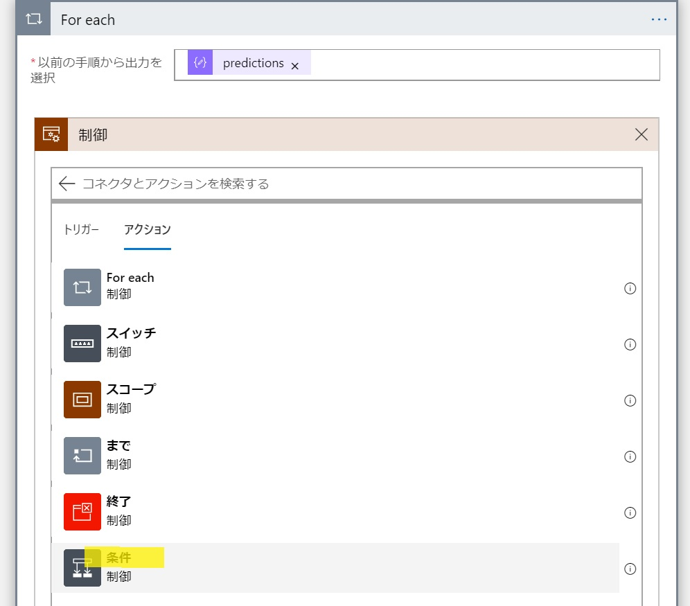
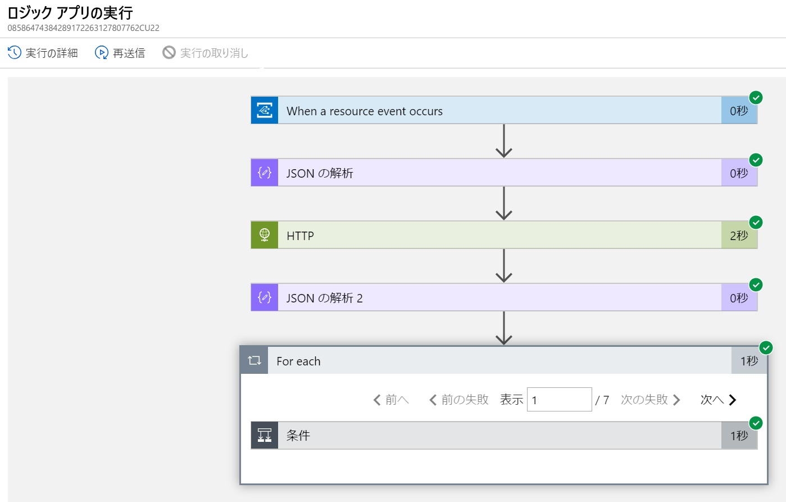
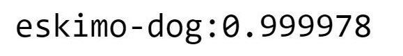

# Global AI Nights - Beginner Track コンテンツ

## 参加者用ワークショップ

## セッション情報

**タイトル:** 見る、聞く、話す、または理解することができるアプリケーションを、Microsoft Cognitive Services で作成する

**概要:** このワークショップでは、まず、[Microsoft Azure Cognitive Services](https://azure.microsoft.com/ja-jp/services/cognitive-services/) を紹介します。Cognitive Servicesは、スクラッチでコーディングすることなく、インテリジェンスと機械学習をアプリケーションに組み込むために使用できるサービス群です。例えば、[Computer Vision](https://azure.microsoft.com/ja-jp/services/cognitive-services/directory/vision/) や [Text Analytics](https://azure.microsoft.com/en-gb/services/cognitive-services/directory/lang/) は、事前に学習済みの AI の API で、REST プロトコルによってアクセスできます。

次に、Cognitive Services をオフラインおよびエッジデバイスで実行できるようにするために、Cognitive Services を[コンテナーでのホストする](hhttps://docs.microsoft.com/ja-jp/azure/cognitive-services/cognitive-services-container-support)方法を説明します。

次に、転移学習を使用しているカスタム AI - [Custom Vision](https://azure.microsoft.com/en-gb/services/cognitive-services/custom-vision-service/) を見ていきます。Custom Vision は、画像分類モデルをトレーニングするために独自のデータをの少量用意するだけでよくなります。

ワークショップの締めくくりとして、独自に学習した AI を組み込んだアプリケーションを構築します。ここで利用する [Logic Apps](https://azure.microsoft.com/ja-jp/services/logic-apps/) は機械学習についての概念実証に理想的です。

## マシンの前提条件

* デモに必要な画像やコードサンプルを入手するために、'Clone or Download' (緑のボタン) > 'Download ZIP' を選択してダウンロードします。または、このリポジトリをローカルマシンに複製してください: `git clone https://github.com/seosoft/AINightsBegineerTrack-JP.git`  
* [Microsoft Azure サブスクリプション](https://azure.microsoft.com/ja-jp/free/)
* モダンブラウザー(Google Chrome, Microsoft Edge)
* [Postman, API Development Environment - available on Windows, Linux and macOS](https://www.getpostman.com/downloads/)

> すべてのデモとコンテンツは Windows PC 上でテストしていますが、すべてのオプションは macOS と Linux マシンでも実行できるはずです。他のオペレーティングシステムについてフィードバックがある場合は、issue または pull request で情報を提供してください。

## タスク 1: Microsoft Azure Cognitive Services - Computer Vision

このタスクでは、Webサイトのデモオプションを使用して Cognitive Services を試します。

サイトを開きます: [https://azure.microsoft.com/ja-jp/services/cognitive-services/directory/vision/](https://azure.microsoft.com/ja-jp/services/cognitive-services/directory/vision/)


各セクションで、多くの異なるデモを試せます（Vision、OCR、Face、Emotioni Detectionn、VideoIndexer でのシーンとアクティビティの認識など）。

**Computer Vision** の **画像内のシーンおよびアクティビティ認識** の横にある **デモ** リンクを選択します。他のサービスを探索するためのデモリンクもあります。


次に、**参照** ボタンを選択して、`sample-images/computer-vision-web-browser/` から cat.jpeg または city.jpeg の画像をアップロードしてみましょう。画像の分析結果を見ることができます。


## タスク 2: Microsoft Azure Cognitive Services - REST 経由で Text Analytics を利用

次は、Cognitive Services をアプリケーションに統合するために使われる REST プロトコルを利用します。

まず、[Microsoft Azure](https://azure.microsoft.com/ja-jp/) に接続して、右上にある **ポータル** を選択します。

ポータルで **リソースの作成** を選択します。**Cognitive Services** を検索して選択します。そのあと、ブレードで **作成** を選択します。


以下を参考に詳細を入力してアカウントを作成します:

* **Name:** サービスに適した任意の名前を入力 (例: `ainightscognitive`)
* **サブスクリプション:** サブスクリプションを選択
* **場所:** 任意の場所を選択（日本リージョンの利用も可能です）
* **Pricing Tier:** S0
* **Resource Group:** '新規選択' を選択して、任意の名前を入力 (例: `ainights`)
* **利用規約ボックスに同意した上で、チェックをオン**
* **'作成' を選択**


作成されたら、通知領域（画面の右上）の **Go to resource** を選択します。


Cognitive Services ページで **Keys** を選択して、**KEY 1** をコピーし、メモ帳などに貼っておきます。


左上の *Overview* を選択して、**Endpoint** の値をコピーし、メモ帳などに貼っておきます。


Postman をローカルマシンにダウンロードして開きます。

> ダウンロード方法は、前述の **マシンの前提条件** を参照

**Request** を選択します。


以下のようにリクエストの詳細を入力し、**新しいコレクションを作成** するオプションを選択して "Text Analytics Samples" という名前を付けます。


新しく作成したコレクションを選択して "保存" を選択します。


以下の手順で Text Analytics API を呼び出すリクエストを作成します:

* 左上の GET リクエストから **POST** リクエストに変更
* Cognitive Services の Endpoint URL を入力して、末尾に次の値を追加: `text/analytics/v2.0/sentiment`
* URL テキストボックスの下の **Headers** を選択
* **Key** に `Ocp-Apim-Subscription-Key` を入力、**Value** に KEY1 の値を入力
* **Key** に `Content-Type` を入力、**Value** に `application/json` と入力
* 
* URL テキストボックスの下の **Body** を選択
* ラジオボタンの `raw` を選択
* `sample-code/cognitive-services-api-task/sentiment-analysis-text.json` の JSON のサンプルをテキストボックスに貼り付けます
* **Send** ボタンを選択して、レスポンスを確認しましょう
* 

KeyPhrases 関数など、REST API から他のオプションを試すこともできます。 URLの末尾を "sentiment" から "keyPhrases" に変更し、"Send" を選択してサンプルテキストのキーフレーズを表示します。

* 

> [こちら](https://docs.microsoft.com/ja-jp/azure/cognitive-services/text-analytics/language-support)で Text Analytics API の言語サポートをチェックしてください。あなたの言語がサポートされている場合は、テキストを翻訳して上記の API の機能を表示するために JSON ファイルを編集してください。フランス語のJSONファイルの例が ```sample-code/text-analytics-demo/sentiment-analysis-text-fr.json``` にあります。このファイルを適切に編集してください。

> Postman の実行に問題がある場合は、[センチメント分析](https://northeurope.dev.cognitive.microsoft.com/docs/services/TextAnalytics.V2.0/operations/56f30ceeeda5650db055a3c9) および [キーフレーズ抽出](https://northeurope.dev.cognitive.microsoft.com/docs/services/TextAnalytics.V2.0/operations/56f30ceeeda5650db055a3c6) の API ドキュメントで REST API を実行できます。サイトで内で使用するデータセンターを選択し、Postman で使用した JSON のサンプルと Key を入力して実行してみましょう。

## タスク 3: Microsoft Azure Cognitive Services - Custom Vision

Microsoft Azure Custom Vision サービスを使用すると、ごくわずかなコードで独自のパーソナライズ画像分類およびオブジェクト検出アルゴリズムを構築できます。この課題では、Standford University によって作成された [ImageNet open dataset]([http://vision.stanford.edu/aditya86/ImageNetDogs/](http://vision.stanford.edu/aditya86/ImageNetDogs/)) オープンデータセットから犬の画像を使用して犬種分類アルゴリズムを作成します。

7つの犬種について、それぞれ 30枚の画像があります。（[ここ](https://github.com/amynic/AINights/blob/master/sample-images/dogs.zip) の.zipファイルで利用可能です）

* Beagle
* Bernese Mountain Dog
* Chihuahua
* Eskimo Dog (Husky)
* German Shepherd
* Golden Retriever
* Maltese

この [.zip folder](sample-images/dogs.zip) にも一連のテスト画像（トレーニング用ではありません）があります。

まず Azure アカウントで Custom Vision インスタンスを作成します。

* [Azure ポータル](https://ms.portal.azure.com) のメインダッシュボードに接続します
* 左上の 'リソースの作成' をクリックします
* 'Custom Vision' を検索します
* Custom Vision の詳細ペインで **作成** をクリックします
* 詳細を入力してください
    * サービスの名前を入力します
    * サブスクリプションを選択します
    * **[重要]** 場所では **米国中南部** (SOUTH CENTRAL US) を選択します
    * 'Prediction pricing tier' および 'Training pricing tier' で 'S0' を選択します
    * このプロジェクト用に作成済みの Resource Group を選択します（例：ainights）
    * '作成' をクリックします
* 

これで分類器を作成し、[https://www.customvision.ai](https://www.customvision.ai) に移動して、Azure 認証情報アカウントでサインインしてください。

> 続行するには、利用規約ボックスに同意してください

ロードされたら 'NEW PROJECT' を選択して詳細入力ウィンドウを開き。

* Name: 適切な名前を入力
* Description: 分類器の説明を入力（例は、下の画像に示します）
* Resource Group: Custom Vision を作成する Resource Group を選択します（例: ainights[SO]）
* Project Types: Classification
* Classification Types: Multiclass (Single tag per image)
* Domains: General
* 

'Create Project' を選択すると、下図のような空のワークスペースが表示されます。


ここで、画像の追加とタグの割り当てを開始して画像分類器を作成します。

画面左上の 'Add images' を選択して、[.zip folder](sample-images/dogs.zip) の最初のフォルダー - Beagle を開き、フォルダー内の 30枚の画像を選択します

タグとして 'beagle' を指定して、'Upload 30 files' で画像をアップロードします 


成功すると確認メッセージが表示され、画像がワークスペースで利用可能になります。


同じ手順で、フォルダー内の他の 6つの犬種の画像をそれぞれタグ付けしてアップロードします:
* 'Add images' をクリックします
* 新しい30枚の犬の画像を選択します
* クラスラベルを入力します (beagle, german-shepherd, maltese など)
* 'Upload' を選択します
* ワークスペースへのアップロードを確認します

すべてのカテゴリがアップロードされ、左側に犬種が表示され、犬の画像の種類に応じてフィルタリングできるようになります。


これで、アップロードした犬の画像データについてアルゴリズムを訓練する準備が整いました。右上隅にある緑色の 'Train' ボタンをクリックしてください。

トレーニングプロセスが完了したら、[Performance]  タブに移動します。ここにはモデルのための機械学習の評価指標が表示されます。


テストに必要なモデルが完成しました。右上にある（'Train' ボタンの横にあります） 'Quick Test' ボタンを選択してください。ウィンドウが開き、そこでローカル画像をブラウズしたり URLを入力することができます。

テストフォルダー内の画像（トレーニングされていない画像）を参照してアップロードします。画像が分析され、モデルがそれが何であると考えているのか（予測タグ）およびモデルの結果に対する信頼性（予測確率）の結果が返されます。 


> モデルがどのように機能するかを確認するには、テストフォルダー内の他の画像に対してこの手順を繰り返します。

上部のツールバーの [Predictions] タブをクリックすると、送信したすべてのテスト画像が表示されます。このセクションは再トレーニングに使用できます。新しいデータを取得したら、これをモデルに追加してパフォーマンスを向上させることができます。画像は重要な順に並べられます - 正しく分類されていれば、モデルに追加された最も新しい情報が画像が先頭に表示されます。最後の画像はモデルによってすでに学習されている他の画像と非常に似ているかもしれませんが、これは正しい分類の重要性が低いものです。


これらの画像をモデルに追加するには、最初の画像を選択してモデルが提供した結果を確認してから、[My Tags] ボックスに正しいタグを入力して [Save and close] をクリックします。


この画像は、予測ワークスペースから消えて、トレーニング画像ワークスペースに追加されます。新しい画像やタグをいくつか追加したら、モデルを再訓練して改善するかどうかを確認できます。

アプリケーション内でこのモデルを使用するには、予測の詳細が必要です。トップバーから [Performance]　タブに移動して　[Prediction URL] を選択します。


これを選択すると、Postman からの API 呼び出しを作成するのに必要な情報が表示されます（'image' または 'image URL' の両方が使えます）。


**おめでとう！** Azure Custom Vision サービスを使用して、特別な犬の分類モデルを作成しました。

## タスク 4: カスタム AI をアプリケーションに組み込み - Azure Logic Apps

このセクションでは、Custom Vision で犬種分類アプリケーションを使用するための Azure Logic App を構築します。

最初に、2つの Azure ストレージアカウントを作成します。

Azure ポータルに移動し、左上にある [リソースの作成] をクリックします。Storage セクションを選択し、最初のオプションの 'Storage Account' を選択します。


2つのストレージアカウントを作成します:
* 一つは画像ファイルを置くのに使います (名前は ainightstor とします)
* もう一つは結果を置くのに使います (名前は resultainights とします)

> 以下の手順を 2回実行して、合計 **2個** のストレージアカウントを作成します

ストレージアカウント作成ページで、設定するためのオプションを入力します:

* **サブスクリプション:** サブスクリプションを選択します
* **リソースグループ:** このワークショップで使っているワークグループを選択します（例: ainights）
* **ストレージアカウント名:** (ユニークな名前である必要があります) 全て小文字でストレージアカウント名を入力します。 *ainightsstor(あなたの名前) や resultsainights(あなたの名前) - ユニークな名前にするために、"かっこをつけずに" 末尾に自分の名前を付けるなどをしてください*
* **場所:** もっとも近いデータセンターを選択します
* **パフォーマンス:** Standard
* **アカウントの種類:** Blob Storage
* **レプリケーション:** ローカル冗長ストレージ (LRS)
* **アクセス層:** ホット

**機能および作成** を選択し、検証されたことを確認してから **作成** を選択します。


展開が完了したら、リソースにアクセスしてアカウント設定を確認します。空のBLOBストレージアカウントを確認するには、[**BLOB**] を選択します。


画像と結果を保存するためにストレージアカウントにコンテナーを追加する必要があります。

**コンテナー** ボタンを選択して、コンテナーの名前を作成します

> **ainightsstor** アカウントには **'images'** コンテナーを作成します

> **resultsainights** アカウントには **'results'** コンテナーを作成します

パブリックアクセスレベルでは、**'コンテナー（コンテナーと BLOB の匿名読み取りアクセス）'** を選択します


> 上の設定で、イメージ保存アカウントと結果保存アカウントについて上記の手順を実行します。

いよいよロジックアプリを作成します - 画像保存アカウントをあなたの AI 分類サービスに接続し、結果保存アカウントに結果を入れます。

Azure ポータルのホームページで、[**リソースの作成**] を選択します。Logic App と入力してサービスを選択します。


以下のように設定の詳細を入力してロジックアプリを作成します:

* **名前:** 犬の分類アプリに適した名前を入力します
* **サブスクリプション:** サブスクリプションを選択します
* **リソースグループ:** (ainights のような既存のものを使います) このワークショップで使っているリソースグループを選択します
* **場所:** もっとも近いデータセンターを選択します
* **Log Analytics:** Off

**作成** を選択します


作成したら、リソースに移動します。ここから、ロジックプロセスを作成することができます。左側のメニューから [**ロジックアプリデザイナー**] を選択し、次に [**Event Grid のリソースイベントが発生するとき**] を選択します。


Azure 認証情報を使用してサインインして Azure Event Grid に接続します。


接続して緑色のチェックマークが表示されたら、[続行]を選択します。

以下のオプションを選択してください:
* **Subscription:** サブスクリプション
* **Resource Type:** Microsoft.Storage.StorageAccounts
* **Resource Name:** 画像用ストレージアカウントを選択します (例: ainightsstor)
* **Event Type 項目 - 1:** Microsoft.Storage.BlobCreated


[**新しいステップ**] を選択します。 **json** と入力して、候補の中から **JSON の解析** を選択します

* **コンテンツ:** テキストボックスを選択すると右側に表示される '動的なコンテンツ' で、 **本文** を選択します
* **スキーマ:** テキストボックスを選択し、[logic-app-schema file](sample-code/logic-app-demo/logic-app-schema.txt) の JSON スキーマを貼りつけます


[**新しいステップ**] を選択します。'Custom Vision' と入力して、**Predict tags from image URL (プレビュー)** を選択します。

接続名を入力し (例: customvisionconnection)、Custom Vision サービスの犬種分類プロジェクトからの予測キーを入力します。犬種分類器への Postman の REST リクエストを確認してそこからか、または Custom Vision サービスサイトの Performance タブから **Prediction Key** を取得します。


次のビューでは、Custom Vision 犬種分類プロジェクトの Project ID と Prediction Key を取得します。これらの値は、Custom Vision ポータルで右上にある設定アイコンを選択すると参照できます。


Logic Apps の画面に戻り、[Image URL] ボックスにカーソルを合わせ、右側の [動的なコンテンツの] で 'URL' を検索して選択します。


次のステップに進みます。

**for each** と入力して、'For each' という灰色のコントロールを選択します。選択したら、 '以前の手順から出力を選択' を選択し、'動的なコンテンツ' から **Predictions** を選択します。


**アクションの追加** を選択します。

'制御' と入力して検索して、**制御** コントロールアイコンで **条件** を選択します。



条件ボックスで、'値の選択' をクリックし、'動的なコンテンツ' で **Predictions Probability** を選択します。

条件として '次の値以上' を選択し、'値の選択' に **0.7** と入力します。（以下の画像の通り）


**true の場合** で、**アクションの追加** を選択します。

'Azure Blob Storage' で検索して、**Azure Blob Storage** アイコンを選択し、**BLOB の作成** を選択します。

接続名に **results** と入力し、'ストレージアカウント' で **resultsainights** を選択します。


'フォルダーのパス' で右端にあるフォルダーアイコンを選択し、'results' を選択します。

'BLOB 名' フィールドに '**result-**' と入力し、'動的なコンテンツ' で 'Id' を選択します。

'BLOB コンテンツ' を選択し、'動的なコンテンツ' で 'Predict tags from image URL' の 'もっと見る' を選択します。そこで、**Prediction Tag** を選択し、テキストボックスに '**:**' と入力します。さらに、動的なコンテンツで **Predictions Probability** を選択します。


最後に、Logic Apps のアクションバーで **保存** を選択します。

保存に成功したら、出力をテストしてみましょう。アクションバーで **実行** を選択します。
**訳注** 実行すると '実行を表示するには、開始操作を実行してください' と表示されます。そのまま次の手順に進んでください。


ここで、作成した画像ストレージアカウント (ainightsstor) に移動します（リソースグループから探すと簡単です）。**BLOB** を選択して、Blobを選択して 'images' コンテナーを選択します。'アップロード' ボタンがあるので、Dogs データテストセットフォルダーから任意の画像をアップロードします。


アップロードできたら、Logic Apps のメインページに戻り、ページ下部の '実行の履歴' を見ます。'成功' した実行の入出力に移動します。


すべてのセクションに緑色のチェックマークが付いているはずです。各セクションを選択して、レイヤー間の入力と出力を表示できます（これは、正しく実行されなかった場合にデバッグするのにも最適な方法です）。



最後に、'resultsainight' BLOBストレージアカウントに移動して、BLOB を選択し、'results' コンテナーを開き、そこに作成されたファイルを確認します。ファイルの内容は、犬の画像から得られる、犬の予測クラス、信頼度スコア
です。


